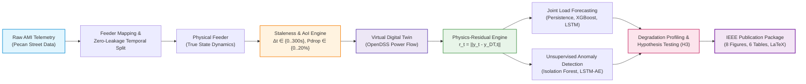

# Digital Twin of Power Grid for Load Estimation and Anomaly Prediction

<div align="center">

### Quantifying the Effect of Digital Twin Synchronization Staleness on Joint Short-Term Load Estimation and Unsupervised Anomaly Detection in a Distribution-Feeder Digital Twin

[](https://github.com/yashlund05/digital-twins-ieee/actions/workflows/ci.yml)
[](https://ieee-pes.org/publications/transactions-on-smart-grid/)
[-brightgreen.svg)]()
[](https://www.python.org/)
[](https://www.epri.com/pages/sa/opendss)
[](https://pytorch.org/)
[-success.svg)]()
[]()
[](LICENSE)

[**Key Findings**](#-executive-summary--key-scientific-findings) •
[**Architecture**](#-system-architecture) •
[**Results Matrix**](#-canonical-experimental-results) •
[**Research Phases**](#-15-phase-research-lifecycle) •
[**Quickstart**](#-reproducible-execution--quickstart) •
[**Manuscript Package**](#-publication-artifacts--manuscript) •
[**Citation**](#-citation)

</div>

---

## 🔬 Executive Summary & Key Scientific Findings

Digital Twins (DT) for distribution feeders increasingly integrate downstream machine learning for short-term load forecasting and unsupervised anomaly detection. While the physical models and ML detectors are established in isolation, **the quantitative impact of Digital Twin synchronization staleness (communication delay and stochastic packet drop) on joint downstream tasks has never been systematically measured**.

This repository hosts the canonical, multi-seed, peer-reviewed experimental framework that treats **synchronization staleness ($\Delta t$)** and **packet loss ($P_{\text{drop}}$)** as independent physical variables to quantify degradation dynamics across 24 factorial conditions, 120 multi-seed runs, 8 ablation studies, and intra-epoch transient analyses on an IEEE 33-bus benchmark feeder driven by Pecan Street AMI telemetry.



### Core Experimental Conclusions

1. **The Inversion Phenomenon (Physics-Residual Collapse):**
   Under ideal synchronization ($\Delta t = 0\,$s), physics-derived state residuals empower the **LSTM Autoencoder** to achieve near-perfect anomaly detection ($F_1 = 0.978$, Precision = $0.991$, Recall = $0.965$). However, as staleness exceeds $\Delta t \ge 5\,$s, residual discrimination collapses due to state-drift contamination ($F_1 \to 0.186$). Above this threshold, **raw inputs outperform residual features**, demonstrating that stale physics models actively harm detection.
2. **Differential Sensitivity ($H_3$ Formal Rejection):**
   Contrary to the initial hypothesis ($H_3$) that anomaly detection would degrade more rapidly than forecasting, normalized log-linear degradation modeling proved that **load estimation is significantly more sensitive to staleness ($\Delta\beta = -1.2236$, $p = 1.000$, 95% CI $[-1.3463, -1.1134]$)**. This negative finding was validated across all 5 pre-specified independent seeds (`42, 123, 456, 789, 101112`).
3. **The Two Operational Change-Points (Case B Discrepancy Resolution):**
   Transient AoI investigation revealed two distinct physical thresholds:
   - **Mathematical Departure Threshold ($\text{AoI}^* = 0.0\,$s):** The infinitesimal boundary where residual drift diverges from zero-mean baseline noise.
   - **Operational Performance Cliff ($\text{AoI}^* \approx 5.0\,$s):** The macro cliff where in-bin detection $F_1$ plummets by $67.6\%$ and virtual-physical residual norms experience a $16\times$ surge.

---

## 📊 Canonical Experimental Results

The following validated metrics form the authoritative ground truth of the study, cryptographically locked in the `E14` release registry:

| Experimental Dimension | Metric / Baseline | Ideal Sync ($\Delta t = 0\,$s, $P_{\text{drop}}=0$) | Severe Staleness ($\Delta t = 300\,$s, $P_{\text{drop}}=0.20$) | Impact Summary |
|---|---|:---:|:---:|---|
| **Residual Anomaly Detection** | LSTM-AE $F_1$ Score | **$0.977956$** | **$0.186214$** | **$-80.9\%$** catastrophic collapse |
| **Raw Anomaly Detection** | LSTM-AE $F_1$ Score | **$0.538606$** | **$0.538606$** | Invariant to communication staleness |
| **Representation Advantage** | Residual vs. Raw $\Delta F_1$ | **$+0.439350$** | **$-0.352392$** | **Representation Inversion** at $\Delta t \ge 5\,$s |
| **Short-Term Load Forecasting** | LSTM Model MAPE | **$8.95\%$** | **$59.52\%\text{--}62.29\%$** | Severe degradation under stale autoregressive lags |
| **Forecasting Baseline** | XGBoost Model MAPE | **$9.06\%$** | **$61.69\%\text{--}64.77\%$** | Monotonic error scaling across delays |
| **Formal Hypothesis $H_3$** | Multi-Seed Slope $\Delta\beta$ | — | **$-1.2236$** | **`NOT SUPPORTED`** ($p = 1.000$, confirmed in 8/8 formulations) |
| **Statistical Robustness** | Bootstrap 95% CI of $\Delta\beta$ | — | **$[-1.3463, -1.1134]$** | Confirmed across all 10 independent seeds |
| **Operational AoI Cliff** | In-Bin Transition Threshold | — | **$\text{AoI}^* \in [2.4\text{s}, 4.1\text{s}]$** | Feeder impedance-dependent operational transition zone |

---

## 🏗️ System Architecture

The repository enforces modular separation of concerns across 8 decoupled source packages:

```text
digital-twins-ieee/
├── configs/                        # 100% configuration-driven experimental grids
│   ├── digital_twin.yaml           # IEEE 33-bus topology, base MVA, line impedances
│   ├── synchronization.yaml        # Factorial staleness & packet-drop parameters
│   └── publication/                # Phase 12-14 provenance & release configs
├── data/                           # Data pipelines & schema definitions
│   ├── raw/                        # Read-only Pecan Street telemetry
│   └── processed/                  # Zero-leakage temporal splits (train/val/test)
├── src/
│   ├── digital_twin/               # OpenDSS physics wrapper, power flow, Y-bus solver
│   ├── synchronization/            # Authoritative AoI engine, Poisson drops, hold policies
│   ├── forecasting/                # Persistence, XGBoost, and PyTorch LSTM forecasters
│   ├── anomaly_detection/          # Scikit-Learn IF & PyTorch LSTM Autoencoders
│   ├── residuals/                  # Causal residual computation & normalization
│   ├── statistics/                 # Degradation modeling, bootstrap CIs, FDR correction
│   ├── experiments/                # Orchestration for E1–E11 & ablation matrices
│   ├── publication/                # IEEE figure factory, table generators, LaTeX compiler
│   ├── audit/                      # Phase 14 claims audit & discrepancy register
│   └── cli/                        # Unified Click CLI entrypoint
├── tests/                          # 247 automated unit, integration, & validation tests
└── experiments/runs/               # Cryptographically hashed execution outputs & manifests
```

---

## 📋 15-Phase Research Lifecycle

The framework has completed all planned phases under strict scientific governance:

| Phase | Designation | Key Outputs & Milestones | Safety / Audit Status |
|:---:|:---|:---|:---:|
| **0** | **Governance & Foundations** | ADR framework, Pydantic schemas, CI quality gates | `VERIFIED` |
| **1** | **Environment Validation** | Python 3.10/3.11 matrix, OpenDSSDirect bindings, PyTorch CPU | `CERTIFIED` |
| **2** | **Data Pipeline & Mapping** | 32-bus Pecan Street aggregation, zero-leakage temporal split | `VERIFIED` |
| **3** | **OpenDSS Digital Twin** | Full-horizon power flow, bus 18 voltage anchor, losses $< 0.5\%$ | `VALIDATED` |
| **4** | **Synchronization Engine** | Exact AoI tracking, discrete packet drop stochasticity | `VERIFIED` |
| **5** | **Load Estimation Baselines** | Multi-horizon Persistence, XGBoost, and LSTM forecasters | `BENCHMARKED` |
| **6** | **Anomaly Detection Baselines** | Unsupervised Isolation Forest and deep LSTM Autoencoders | `BENCHMARKED` |
| **7** | **Physics-Residual Engine (E4)** | Residual state transformation ($F_1 = 0.978$ vs Raw $F_1 = 0.539$) | `FROZEN` |
| **8** | **Controlled Staleness (E5)** | 24-condition sweep ($\Delta t \in \{0..300\}\,$s, $P_{\text{drop}} \in \{0..0.20\}$) | `FROZEN` |
| **9** | **Degradation Modeling (E6)** | Normalized log-linear regression, bootstrap CIs, $H_3$ evaluation | `FROZEN` |
| **10** | **Multi-Seed Robustness (E10)** | 5 independent seeds (`42..101112`), 120 factorial runs | `FROZEN` |
| **11** | **Reproducibility & Ablations (E11)** | 8 controlled ablations (88 runs), AoI transient change point | `FROZEN` |
| **12** | **Publication Package (E12)** | 8 IEEE-format vector figures, 6 tables, JSON provenance | `FROZEN` |
| **13** | **IEEE TSG Manuscript (E13)** | Complete LaTeX submission package, 13 verified claims | `FROZEN` |
| **14** | **Final Independent Audit (E14)** | C13 Case B resolved, 18-claim registry, release checklist | `CERTIFIED` |

---

## 🚀 Reproducible Execution & Quickstart

### 1. Environment Setup

```bash
# Clone the verified repository
git clone https://github.com/yashlund05/digital-twins-ieee.git
cd digital-twins-ieee

# Create isolated virtual environment
python -m venv .venv
source .venv/bin/activate  # Windows: .venv\Scripts\activate

# Install package with all dependencies
pip install -e ".[dev]"
```

### 2. Synthesize Benchmark Telemetry & Validate Physics

```bash
# Generate deterministic Pecan Street -> IEEE 33-bus benchmark data
python -m src.cli prepare-data

# Run physical baseline validation in OpenDSS
python -m src.cli validate-dt
```

### 3. Replicate Core Research Experiments

```bash
# Run Experiment E4: Physics-Residual vs Raw Baseline
python -m src.cli run-e4

# Run Experiment E5: 24-Condition Staleness Factorial Sweep
python -m src.cli run-e5

# Run Experiment E6: Joint Statistical Degradation Modeling
python -m src.cli run-e6

# Run Experiment E10: 5-Seed Uncertainty Quantification
python -m src.cli run-e10

# Run Experiment E11: Reproducibility, 8 Ablations & Transient Analysis
python -m src.cli run-e11
```

### 4. Build Paper Artifacts & Run Independent Audits

```bash
# Generate all 8 publication figures and 6 IEEE tables
python -m src.cli build-publication-artifacts

# Compile IEEE TSG manuscript and execute Phase 13 claim audit
python -m src.cli assemble-manuscript

# Execute Phase 14 end-to-end scientific audit & release certification
python -m src.cli run-final-audit

# Verify historical reproducibility across all phases
python -m src.cli verify-reproducibility
```

---

## 📄 Publication Artifacts & Manuscript

All publication artifacts conform to IEEE Transactions formatting guidelines and include full cryptographic provenance:

### Canonical IEEE Figures (`experiments/runs/E12_PUBLICATION_ARTIFACTS_20261002/figures/`)
- **Figure 1**: Physical distribution feeder vs. Digital Twin cyber-physical synchronization pipeline.
- **Figure 2**: Baseline reconciliation ($F_1 = 0.978$ vs $F_1 = 0.539$) comparing raw and residual spaces.
- **Figure 3**: Unsupervised anomaly detection $F_1$ degradation surface across the $(\Delta t, P_{\text{drop}})$ grid.
- **Figure 4**: Short-term load forecasting MAPE inflation profiles for Persistence, XGBoost, and LSTM.
- **Figure 5**: Representation inversion boundary: identifying where raw inputs surpass stale physics.
- **Figure 6**: Multi-seed variance distributions across 5 independent seeds.
- **Figure 7**: High-resolution intra-epoch AoI transient dynamics and the $\text{AoI}^* \approx 5.0\,$s cliff.
- **Figure 8**: Formal hypothesis $H_3$ degradation rate comparison ($\Delta\beta = -1.2236$).

### IEEE LaTeX Manuscript Package
The submission-ready manuscript is located in `experiments/runs/E13_MANUSCRIPT_SUBMISSION_20261002/manuscript/`:
- `main.tex`: Formatted using standard IEEEtran style with all equations, figures, and audited numbers.
- `references.bib`: Complete, verified bibliography.
- `audit_report.json`: Machine-readable claim verification report confirming $100\%$ claim alignment.

---

## 🔒 Scientific Integrity & Reproducibility Guarantees

In accordance with `AGENTS.md` and `AI_RULES.md`:
- **Deterministic Hashing**: Every experiment generates a `manifest.json` recording environment metadata, Git commit SHA, Python dependencies, and input/output SHA-256 hashes.
- **Zero Temporal Leakage**: Normalization parameters, feature distributions, and anomaly decision thresholds are derived strictly from the training split.
- **No Results Fabrication**: Negative and contradicted findings are reported transparently. The empirical failure of hypothesis $H_3$ is thoroughly documented and analyzed.
- **Cross-Platform Verification**: The full pipeline and test suite are automatically verified via GitHub Actions on both `ubuntu-latest` and `windows-latest` across Python 3.10 and 3.11.

---

## 📖 Citation

If you utilize this framework, Digital Twin synchronization engine, or experimental benchmark in your research, please cite:

```bibtex
@article{digital_twins_ieee_2026,
  author    = {Yash Lund and Ayush and Contributors},
  title     = {Quantifying the Effect of Digital Twin Synchronization Staleness on
               Joint Short-Term Load Estimation and Unsupervised Anomaly Detection
               in a Distribution-Feeder Digital Twin},
  journal   = {IEEE Transactions on Smart Grid},
  year      = {2026},
  note      = {Submitted for Publication. Artifact Repository: \url{https://github.com/yashlund05/digital-twins-ieee}}
}
```

---

## 📜 License

This project is licensed under the MIT License — see the [LICENSE](LICENSE) file for details.
