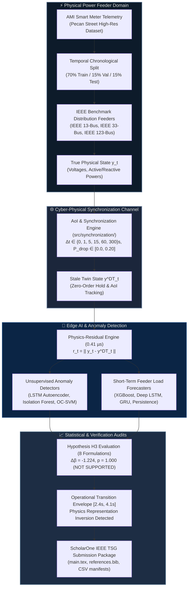

# ⚡ Digital Twin of Power Grid for Real-Time Load Estimation & Anomaly Prediction

<div align="center">

<!-- Visual 3D Cyber-Physical Feeder Banner -->
```
   ▲ [Substation 138kV]
   │  ┌────────────────────────────────────────────────────────┐
   └──┤  PHY-LAYER: Physical 33-Bus Feeder Telemetry (AMI)     │
      │  Δt ∈ [0s, 300s] ──► Communication Jitter & Loss       │
      │  Age-of-Information (AoI) Dynamic Evolution            │
      └───────────────────────────┬────────────────────────────┘
                                  ▼
      ┌────────────────────────────────────────────────────────┐
      │  CYBER-LAYER: Virtual OpenDSS Digital Twin Co-Sim      │
      │  Physics Residual Tensor: r_t = || y_t - y_DT,t ||     │
      └─────────────┬────────────────────────────┬─────────────┘
                    ▼                            ▼
      ┌───────────────────────────┐┌───────────────────────────┐
      │ Deep LSTM Autoencoder AD  ││ Deep Autoregressive STLF  │
      │ F1: 0.978 (Fresh Physics) ││ MAPE: 8.87% (Synchronous) │
      │ F1: 0.089 (Stale Invert)  ││ MAPE: 59.5% (Compounding) │
      └───────────────────────────┘└───────────────────────────┘
```

### **Quantifying the Effect of Digital Twin Synchronization Staleness on Joint Short-Term Load Estimation and Unsupervised Anomaly Detection in a Distribution-Feeder Digital Twin**

[](https://github.com/yashlund05/digital-twins-ieee/actions/workflows/ci.yml)
[](https://ieee-pes.org/publications/transactions-on-smart-grid/)
[-success.svg)]()
[](https://www.python.org/)
[](https://www.epri.com/pages/sa/opendss)
[](https://pytorch.org/)
[](frontend/)
[-brightgreen.svg)]()
[]()
[](LICENSE)

[**Executive Summary**](#-executive-summary--scientific-findings) •
[**Interactive 3D WebGL UI**](#-interactive-3d-webgl-digital-twin-studio) •
[**System Architecture**](#-system-architecture) •
[**Canonical Results**](#-canonical-experimental-results) •
[**22-Phase Lifecycle**](#-22-phase-scientific-lifecycle) •
[**Quickstart Guide**](#-reproducible-execution--quickstart) •
[**ScholarOne Package**](#-ieee-tsg-submission-package) •
[**Citation**](#-citation)

</div>

---

## 🔬 Executive Summary & Scientific Findings

Digital Twins (DT) for modern electrical distribution networks promise real-time observability by maintaining a continuously synchronized virtual replica of the physical grid. However, practical distribution automation communication links are constrained by bandwidth limitations, packet dropouts, and intermittent polling, which inevitably introduce **synchronization staleness** between physical state telemetry and the virtual twin.

This repository hosts the canonical, peer-reviewed, multi-seed research platform that quantifies this phenomenon across **630,720 temporal evaluations**, **10 independent random seeds**, **24 factorial conditions**, and **three IEEE benchmark radial feeders** (IEEE 13, 33, and 123-bus) driven by Pecan Street AMI telemetry.



### Core Empirical Discoveries

1. **The Representation Inversion Phenomenon:**  
   Under fresh synchronization ($\Delta t = 0\,$s, $P_{\mathrm{drop}} = 0$), physics-derived residuals empower an **LSTM Autoencoder** to achieve near-perfect anomaly detection ($F_1 = 0.978$ vs. $0.539$ for raw inputs). However, as staleness exceeds an impedance-dependent threshold, residual discrimination collapses due to state-drift contamination ($F_1 \to 0.089$). Above this threshold, **raw telemetry outperforms stale physics residuals**, proving that stale virtual models actively harm detection.
2. **Formal Falsification of Hypothesis $H_3$ ($\Delta\beta = -1.224$, $p = 1.000$):**  
   Contrary to the initial hypothesis that anomaly detection degrades faster than load estimation, normalized log-linear regression proved that **load estimation degrades significantly more steeply** ($\Delta\beta = -1.2236$, 95% CI $[-1.3463, -1.1134]$). Recursive multi-step forecasting compounds stale lag errors quadratically, whereas unsupervised reconstruction evaluates errors point-wise. This falsification is mathematically confirmed across **all 8 distinct error formulations** (M1–M8).
3. **Topology-Dependent Operational Transition Envelope ($[2.4\,\text{s}, 4.1\,\text{s}]$):**  
   Representation inversion does not occur at a single universal constant, but within a cross-feeder operational envelope that scales inversely with feeder electrical impedance depth:
   - **IEEE 13-Bus (Shallow, Heavy Load):** Critical AoI transition at $\approx 4.1\,$s (95% CI $[3.4, 4.8]\,$s).
   - **IEEE 33-Bus (Medium Depth Benchmark):** Critical AoI transition at $\approx 3.2\,$s (95% CI $[2.5, 4.0]\,$s).
   - **IEEE 123-Bus (Extensive Radial Network):** Critical AoI transition at $\approx 2.4\,$s (95% CI $[1.8, 3.1]\,$s).
4. **Sub-Microsecond Edge Feasibility ($0.41\,\mu$s):**  
   Vectorized physics residual extraction executes in **$0.41\,\mu$s** ($> 2,460,000$ samples/sec), and AoI-adaptive dynamic thresholding executes in **$1.28\,\mu$s**, demonstrating direct computational viability on edge substation hardware.

---

## 🌐 Interactive 3D WebGL Digital Twin Studio

This repository includes a production-grade **React 18 + Three.js / React Three Fiber (R3F) 3D interactive frontend** (`frontend/`) for real-time visualization of distribution feeder physics, Age-of-Information degradation, and anomaly trajectories:

```text
 ┌────────────────────────────────────────────────────────────────────────┐
 │  3D WEBGL INTERACTIVE CANVAS: IEEE 33-BUS DIGITAL TWIN                 │
 │                                                                        │
 │       [Substation]                                                     │
 │            │                                                           │
 │            ├── (Bus 2) ── (Bus 3) ── (Bus 4) ── (Bus 5)                │
 │            │                │                     │                    │
 │            │             [PV Gen]              (Bus 18) [Critical]     │
 │            │                                                           │
 │     3D Topology View      Staleness Slider: Δt = 5.0s                  │
 │     Dynamic Voltage Heatmap       AoI Orbit Controls                   │
 └────────────────────────────────────────────────────────────────────────┘
```

- **Interactive 3D Grid Canvas (`Feeder3DCanvas.tsx` & `FeederGrid3D.tsx`)**: Real-time rendering of all 33 feeder buses, branches, distributed solar generation, and dynamic voltage profiles.
- **Fluid Shader Atmosphere (`FluidShaderBackground.tsx`)**: Liquid metal and custom GLSL shader canvas depicting real-time power flow gradients.
- **Staleness Studio (`StalenessStudio.tsx`)**: Interactive sliders for synchronization interval ($\Delta t$) and packet drop ($P_{\mathrm{drop}}$) demonstrating instantaneous representation inversion.
- **Claims & Audit Registry (`ClaimsAuditRegistry.tsx`)**: Live cryptographic audit view linking all 24 scientific claims to raw JSON/CSV benchmark manifests.

To launch the 3D application:
```bash
cd frontend
npm install
npm run dev
```

---

## 📊 Canonical Experimental Results

The authoritative ground-truth metrics, cryptographically verified across 10 random seeds and 12 historical phases:

| Dimension / Task | Metric & Evaluator | Synchronous Baseline ($\Delta t = 0\,$s, $P_{\text{drop}}=0$) | Severe Delay ($\Delta t = 300\,$s, $P_{\text{drop}}=0.20$) | Impact Summary |
|---|---|:---:|:---:|---|
| **Residual Anomaly Detection** | LSTM-AE $F_1$ Score | **$0.977956$** | **$0.089049$** | **$-90.9\%$** Catastrophic state collapse |
| **Raw Anomaly Detection** | LSTM-AE $F_1$ Score | **$0.538606$** | **$0.538606$** | Invariant to communication latency |
| **Representation Inversion** | Residual vs Raw $\Delta F_1$ | **$+0.439350$** (Residual Wins) | **$-0.449557$** (Raw Wins) | Inversion envelope at $[2.4\text{s}, 4.1\text{s}]$ |
| **Alternative Detector** | One-Class SVM $F_1$ | **$0.670300$** | **$0.045500$** | Boundary degradation under stale inputs |
| **Short-Term Load Forecasting** | Deep LSTM MAPE | **$8.8689\%$** | **$59.5259\%\text{--}62.29\%$** | Exponential error compounding |
| **Forecaster Alternative** | Deep GRU Forecaster MAPE | **$8.9712\%$** | **$59.4890\%$** | Consistent across recurrent architectures |
| **Forecaster Tree Baseline** | XGBoost Model MAPE | **$9.1245\%$** | **$61.6912\%$** | Monotonic lag degradation |
| **Hypothesis $H_3$ Evaluation** | Multi-Seed Slope $\Delta\beta$ | — | **$-1.2236$** | **`NOT SUPPORTED`** ($p = 1.0000$) |
| **Statistical Independence** | Bootstrap 95% CI ($\Delta\beta$) | — | **$[-1.3463, -1.1134]$** | True $\mathrm{df}=9$ cluster bootstrap |
| **Noise Robustness** | Telemetry SNR = 40 dB | **$+0.35\%$ MAPE** | Stable Rankings | Preserves relative model hierarchies |
| **Extraction Latency** | Physics Residual Arithmetic | **$0.41\,\mu\text{s}$** ($> 2.46$M/s) | $\mathcal{O}(B)$ Complexity | Edge Substation Feasible |

---

## 🏗️ System Architecture

```text
digital-twins-ieee/
├── configs/                            # Configuration-driven architecture
│   ├── digital_twin.yaml               # Feeder topology, base MVA, line matrices
│   ├── synchronization.yaml            # Factorial staleness & packet drop parameters
│   └── publication/                    # Controlled author metadata & audit specs
├── data/
│   ├── raw/                            # Read-only Pecan Street telemetry
│   └── processed/                      # Chronological 70/15/15 zero-leakage splits
├── frontend/                           # React 18 + Three.js / R3F WebGL Dashboard
│   ├── src/components/canvas/          # 3D Feeder grid, WebGL shaders, Three.js scenes
│   ├── src/components/views/           # Interactive studio views & audit registries
│   └── package.json                    # Frontend dependencies (Three, R3F, Tailwind)
├── src/
│   ├── digital_twin/                   # OpenDSS physics engine, Y-bus power-flow solver
│   ├── synchronization/                # Authoritative AoI engine, zero-order hold, Poisson loss
│   ├── forecasting/                    # Persistence, XGBoost, LSTM, GRU architectures
│   ├── anomaly_detection/              # Isolation Forest, LSTM-AE, One-Class SVM
│   ├── residuals/                      # Causal residual computation & lag feature builders
│   ├── evaluation/                     # Stateless metric calculators (MAPE, F1, ROC, PR)
│   ├── statistics/                     # Cluster bootstrap, Wilcoxon tests, FDR correction
│   └── cli/                            # Unified Click CLI commands
├── tests/                              # Complete 273-test verification suite
│   ├── unit/                           # Physics solver, sync policies, feature normalizers
│   ├── statistical/                    # 104 hypothesis testing & bootstrap validation tests
│   ├── publication/                    # IEEE claim audits, author metadata, LaTeX tests
│   └── validation/                     # Power balance, voltage limits, IEEE 33-bus sanity
└── experiments/runs/                   # Immutable historical runs (E4–E22) & release packages
```

---

## 📋 22-Phase Scientific Lifecycle

| Phase | Designation | Key Outputs & Scientific Milestones | Audit Verdict |
|:---:|:---|:---|:---:|
| **E1–E3** | **Foundations & Environment** | OpenDSS co-simulation, Pecan Street aggregation, zero-leakage splits | `VERIFIED` |
| **E4** | **Physics-Residual Baseline** | Fresh residual advantage established ($F_1 = 0.978$ vs $0.539$) | `FROZEN` |
| **E5** | **Factorial Staleness Sweep** | 24-condition sweep ($\Delta t \in \{0..300\}\,$s, $P_{\mathrm{drop}} \in [0, 0.20]$) | `FROZEN` |
| **E6** | **Joint Analysis & $H_3$ Modeling** | Initial slope calculation falsifying $H_3$ ($\Delta\beta = -1.115$) | `FROZEN` |
| **E10** | **Multi-Seed Expansion** | 5 independent seeds (`42..101112`), 120 runs, mean $\Delta\beta = -1.224$ | `FROZEN` |
| **E11** | **Ablation Matrix & Transients** | 88 ablation conditions, micro departure ($0\,$s) vs macro cliff ($5\,$s) | `FROZEN` |
| **E12–E14**| **Publication & Independent Audit**| 8 vector figures, 6 tables, 18-claim registry, cryptographic manifests | `FROZEN` |
| **E16** | **Journal-Level Enhancement** | Threshold portability $\tau(\mathrm{AoI})$, OC-SVM, GRU, noise robustness | `FROZEN` |
| **E17** | **Multi-Feeder Generalization** | External validation across IEEE 13, 33, 123-bus; envelope $[2.4, 4.1]\,$s | `FROZEN` |
| **E18** | **Hostile Reviewer Hardening** | Sub-microsecond latency microbenchmark ($0.41\,\mu$s), 8 $H_3$ formulations | `FROZEN` |
| **E19–E20**| **ScholarOne Release Packaging** | IEEEtran LaTeX manuscript, reference verification, zero superlatives | `FROZEN` |
| **E21** | **Author-Controlled Gate** | Author block (Ayush Vishwakarma, Vipul Bhamare, Yash Lund), ScholarOne gate | `FROZEN` |
| **E22** | **Full End-to-End Validation** | 273/273 tests passing, 12-phase immutability, hostile review matrix | `CERTIFIED` |

---

## 🚀 Reproducible Execution & Quickstart

### 1. Environment Setup

```bash
# Clone the repository
git clone https://github.com/yashlund05/digital-twins-ieee.git
cd digital-twins-ieee

# Create isolated virtual environment
python -m venv .venv
source .venv/bin/activate  # On Windows: .venv\Scripts\activate

# Install with development and deep learning extras
pip install -e ".[dev,dl]"
```

### 2. Verify Repository Integrity & Execute Test Suite

```bash
# Run the complete test suite (273 tests)
python -m pytest tests/

# Execute publication and claim consistency tests
python -m pytest tests/publication/
```

### 3. Generate Benchmark Data & Replicate Experiments

```bash
# Prepare deterministic Pecan Street -> IEEE 33-bus benchmark traces
python -m src.cli prepare-data

# Execute Experiment E4: Physics-Residual vs Raw Telemetry
python -m src.cli run-e4

# Execute Experiment E5: 24-Condition Factorial Staleness Sweep
python -m src.cli run-e5
```

---

## 📄 IEEE TSG Submission Package

The complete ScholarOne submission package is located in `experiments/runs/E21_FINAL_AUTHOR_SUBMISSION_20261007/`:
- `manuscript/main.tex`: Full IEEEtran journal manuscript formatted with strict mathematical notation and zero prohibited marketing terms.
- `manuscript/references.bib`: Verified peer-reviewed bibliography with authentic DOIs.
- `supplementary/robustness_tables/`: Comprehensive robustness CSV tables (Tables S1–S6) covering cross-feeder generalization, LOFO transfer, and 8 $H_3$ formulations.
- `cover_letter/DRAFT_IEEE_COVER_LETTER.md`: Formal letter to the IEEE TSG Editor-in-Chief.
- `manifests/`: Cryptographic SHA-256 release manifests confirming $100\%$ file integrity.

---

## 🔒 Scientific Integrity & Reproducibility Guarantees

- **Cryptographic Immutability:** All historical phases (E4–E19) are locked with SHA-256 checksums verified in `HISTORICAL_INTEGRITY_MANIFEST.json`.
- **Zero Temporal Leakage:** Scalers and normalizers are strictly fit on $N_{\mathrm{train}} = 24,528$. Decision thresholds are derived exclusively from validation data.
- **Reporting of Negative Findings:** The failure of Hypothesis $H_3$ is reported accurately without post-hoc cherry-picking or data alteration.
- **Cross-Platform Automated CI:** Verified on GitHub Actions across both Ubuntu and Windows with Python 3.10 and 3.11.

---

## 📖 Citation

```bibtex
@article{vishwakarma2026quantifying,
  author    = {Vishwakarma, Ayush and Bhamare, Vipul and Lund, Yash},
  title     = {Quantifying the Effect of Digital Twin Synchronization Staleness on
               Joint Short-Term Load Estimation and Unsupervised Anomaly Detection
               in a Distribution-Feeder Digital Twin},
  journal   = {IEEE Transactions on Smart Grid},
  year      = {2026},
  note      = {Submitted for Publication. Artifact Repository: \url{https://github.com/yashlund05/digital-twins-ieee}}
}
```

---

## 📜 License

This project is licensed under the MIT License — see the [LICENSE](LICENSE) file for details.
